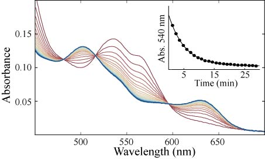
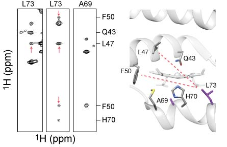
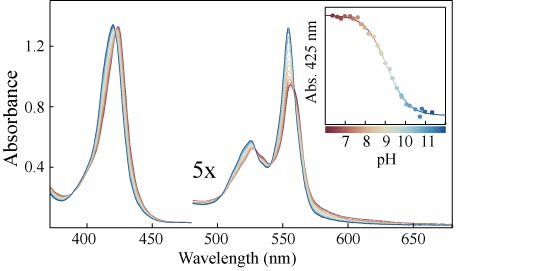

*   
  The transfer of heme from the hemoglobin GlbN to horse myoglobin monitored in time by electronic absorption spectroscopy. The spectrum of GlbN (red) gradually converts to the spectrum of myoglobin (blue). The inset shows the kinetics of the reaction and a fit to a single exponential. 

  These data were collected on a variant of GlbN which releases heme ~1000x faster than the WT protein. The increased off-rate for heme binding indicates a decreased affinity in the variant. <i>Unpublished data.</i>

  In this type of experiment, I get to watch my sample change color - on of my favorie aspects to hemoglobin research.

*   
  Portions of a methyl selective NOESY NMR spectrum collected on a hemoglobin variant are shown on the left. Peaks represent two atoms that are close to one another in the structure of the protein. Important peaks are then labeled with the two corresponding protein residues. These residues are shown in the structure of the WT protein on the right.

  A single residue change in this protein causes the heme cofactor to move from its native position. This figure demonstrates well the remarkable structural rearrangement. <i>Unpublished data.</i>

  This result represents the answer to a long-standing question in our subfield, and took me several years and a bit of luck to solve. 
*   
  A pH titration of a cyanobacterial hemoglobin in the ferrous oxidation state by electronic absorption spectroscopy. At neutral pH (red) two histidine residue coordinate the heme iron. As the pH is raised (red-blue gradient) a lysine residue displaces a histidine as heme ligand. The inset shows a fit of the data to yield an apparent pKa of 9.2.

  These data allowed for a thermodynamic characterization of the ligand-switch, while NMR provided structural and kinetic insight. Adapted from Nye, D. B. et al., <i>Biochemistry 57</i>, 631-644.

  This project was experimentally demanding because the samples were unstable and difficult to produce. This titration represents a particularly gruelling Saturday, but it was worth it!

