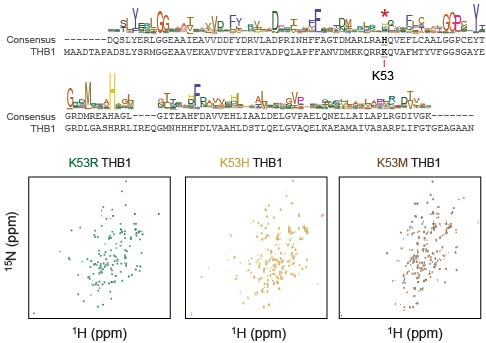
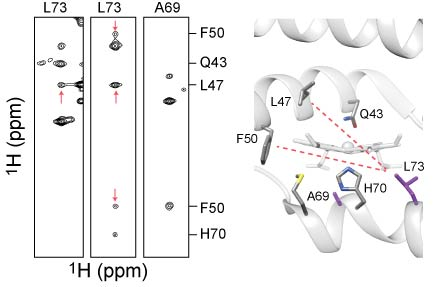
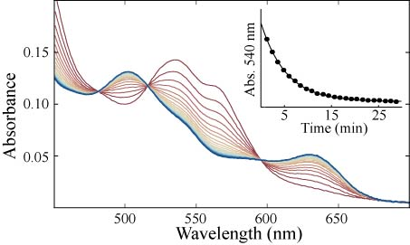
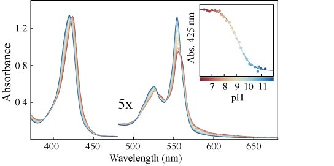
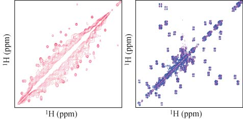
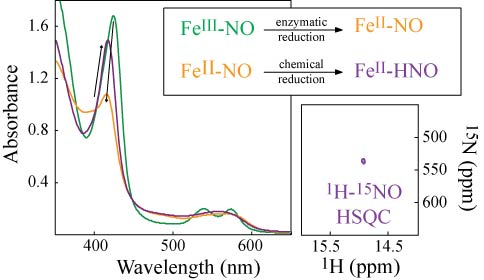

*   
  The sequence logo of truncated hemoglobins illustrates low sequence conservation in this polyfunctional protein family. Here, the model globin THB1 was used as a scaffold to replace Lys53 with other residues found at this position. These replacements produce globins with varied structural and reactive properties. <i>Unpublished data.</i>

  Hemoglobins make use of a common fold and cofactor to achieve functional diversity. They do so with subtle and dispersed changes in protein sequence. The sequencing revolution offers new avenues to investigate the sequence-structure-function paradigm in globins.    
*   
  A NOESY NMR spectrum gives information about the structure of a protein. This spectrum has 4 dimensions: 3 are nuclear frequencies and the 4th is intensity (contours). Here, the structure of a globin variant is shown to be different from that of the parent protein. We found that a single residue change causes the heme cofactor to move from its native position. Adapted from Nye, D. B. and Lecomte, J. T. J. (2018) <i>Biochemistry 57</i>, 5785-5796.

  Hemoglobins have been around for hundreds of millions of years, and almost always conserve the globin topology and standard heme site. This new conformation has the usual topology but a novel binding site, offering insight into the flexibility of the globin family.
*   
  A heme transfer experiment performed on a cyanobacterial hemoglobin. Rapid release of heme reflects low-affinity binding, and this variant loses the cofactor ~1000x faster than the parent protein. By removing a non-conserved ligand to the iron, we perturb the heme site and dramatically lower the binding affinity. Adapted from Nye, D. B. and Lecomte, J. T. J. (2018) <i>Biochemistry 57</i>, 5785-5796.

  Productive interactions between a protein and its cofactor are complex and difficult to engineer. Over time, hemoglobins have evolved multiple mechanisms to ensure strong association with the prosthetic group.
*   
  This hemoglobin switches from a histidine iron ligand (red) to a lysine ligand (blue) as the pH is increased. By monitoring the equilibrium as a function of pH, we learn about the thermodynamics of globin ligand-switching. Adapted from Nye, D. B., et al. (2018) <i>Biochemistry 57</i>, 631-644.

  Globins use one or two residues to ligate the heme iron. These residues set the catalytic properties and influence the biological function. The sensitivity to pH observed here has broad implications for heme protein ligand control.

*   
  Two conformations of a single hemoglobin in equilibrium in the NMR tube. Conformational dynamics were measured with a ZZ exchange spectrum (left). A simultaneous structural description of the two forms was achieved with a number of NMR experiments, including the COSY (right). Adapted from Nye, D. B., et al. (2018) <i>Biochemistry 57</i>, 631-644.

  Proteins exist as many intercoverting species all at once. NMR is an incredible technique to derive atomic resolution structural, kinetic and thermodynamic information from these complex ensembles.

*   
  The reductive conversion of nitric oxide to HNO by a cyanobacterial hemoglobin. Increasingly powerful reductants were required to drive this difficult reaction. Production of the rare HNO molecule was confirmed with NMR using isotopically labeled substrate. Adapted from Preimesberger, M. P., et al. (2017) <i>J. Inorg. Biochem. 177</i>, 171-182.

  Nitric oxide is most noted for its role in cell signaling. In cyanobacteria and alga, it can be a secondary metabolite and toxic radical. Globins are able to catalyze a number of detoxifying reactions with ROS and RNS, but the production of HNO was certainly unexpected.
